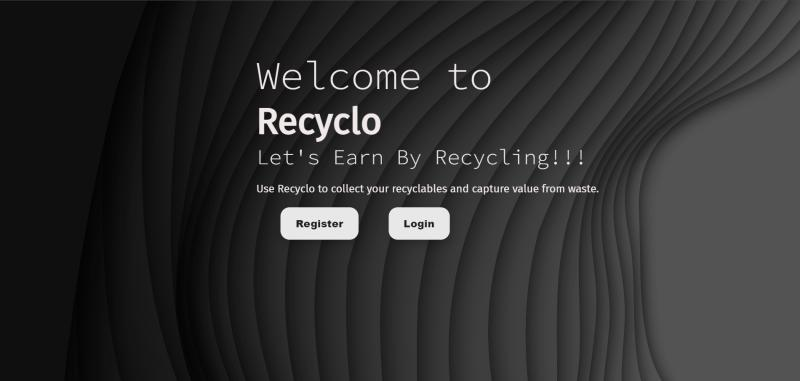
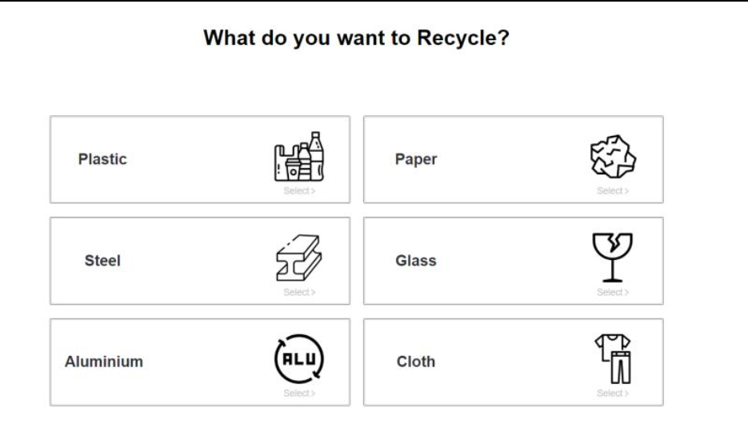
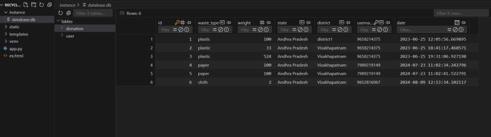

# Recyclo – Rewards-Based Waste Management Web App

> 🛠️ This is a personal fork of the original [Recyclo project](https://github.com/karanamsruthi17/Recyclo) developed collaboratively with [Karanam Sruthi](mailto:karanamsruthi17@gmail.com).  
> This repository showcases my individual contributions and enhancements.

Recyclo is a web application designed to enhance waste management and recycling efficiency. It provides a robust platform for users to manage waste donations and receive rewards. By integrating a rewards-based approach, Recyclo aims to make recycling more appealing and effective, capturing value from waste and encouraging sustainable practices.

---

## 🧩 My Contributions

- 🔐 Implemented user registration, login, and profile management using Flask and SQLAlchemy.
- 🗑️ Built the donation submission workflow: input waste type, weight, and select recycling hubs.
- 🎟️ Developed the dynamic coupon generation system based on donation weight.
- 🎨 Designed key front-end pages using HTML, CSS, JavaScript, and Jinja2 templates.
- 🧪 Tested core functionality and improved UI layout based on Figma designs.

---


## 🖼️ Screenshots

### 🔐 Login Page


### 🗑️ Donation Dashboard


### 🎟️ Coupon Generation


### 🎟️ Database

## 🚀 Key Features

- **User Management:** Easy registration, login, and profile updates.
- **Donation Workflow:** Specify waste types, input donation weights, and find local recycling hubs.
- **Coupon System:** Generates coupons based on the amount of recyclable materials donated, incentivizing recycling and promoting greater community engagement.
- **Donation Logs:** Track and view detailed records of all donations.

---

## 🧱 Tech Stack

- **Flask:** Web framework for backend development.
- **SQLAlchemy:** ORM for database management.
- **HTML/CSS:** Structuring and styling the UI.
- **Python:** Backend logic and APIs.
- **Jinja2:** Templating engine for dynamic pages.
- **Figma:** Interface mockups.
- **JavaScript:** UI interactivity.

---

## ⚙️ Getting Started

1. **Clone the Repository**
    ```bash
    git clone https://github.com/yourusername/Recyclo.git
    ```

2. **Navigate to the Project Directory**
    ```bash
    cd Recyclo
    ```

3. **Set Up a Virtual Environment**
    ```bash
    python -m venv venv
    ```

4. **Activate the Virtual Environment**
    - Windows:
      ```bash
      venv\Scripts\activate
      ```
    - macOS/Linux:
      ```bash
      source venv/bin/activate
      ```

5. **Install Dependencies**
    ```bash
    pip install -r requirements.txt
    ```

6. **Initialize the Database**
    ```bash
    flask shell
    >>> from app import db
    >>> db.create_all()
    >>> exit()
    ```

7. **Run the Application**
    ```bash
    flask run
    ```

8. **Open in Browser**
    Visit: `http://127.0.0.1:5000`

---

## 💬 Contact

Feel free to connect or ask questions!  
📧 sriema1708@gmail.com  
🔗 [LinkedIn](https://in.linkedin.com/in/sri-emandi-5a4335226)

---

